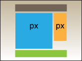
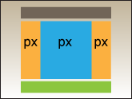

# Базовые макеты страницы в CSS

1. Необходимо сверстать 3 макета страницы, используя свойства `float` и `margin`.
2. Один из свёрстанных макетов дополнить до полного шаблона персонального блога — страница должна включать в себя название, основную верхнюю навигацию, боковую навигацию по подразделам, 2–3 короткие записи, форму для добавления комментариев.

  
